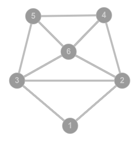

* this line gets replaced with the generated table of contents
{:toc}

# print

<https://en.wikipedia.org/wiki/Rank_(linear_algebra)#Properties>
<https://en.wikipedia.org/wiki/Trace_(linear_algebra)>

<https://en.wikipedia.org/wiki/List_of_limits>
<https://en.wikipedia.org/wiki/Squeeze_theorem>

<https://en.wikipedia.org/wiki/Differentiation_rules>
<https://en.wikipedia.org/wiki/Limit_of_a_sequence#Properties>
<https://en.wikipedia.org/wiki/Indeterminate_form>
<https://en.wikipedia.org/wiki/Taylor_series>
<https://en.wikipedia.org/wiki/Limit_of_a_function#Properties>

# 2012

## 27-05-2012

### 1 -- [se- ss- sl- combinatorics]

Сколько способов пройти из $(0,0,0)$ в $(n,2n,3n)$, если можно делать шаги на $+1$ по любой из осей?

### 2 -- [se- ss- sl- ll-]

Найти $f^{(319)} (0)$, если $f(x) = \frac{x^2+17}{x^4 - 5x^2+4}$.

### 3 -- [se- ss- sl- algebra permutations]

Сколько перестановок коммутируют с $(123)(456)$?

### 4 -- [se- ss- sl- probability]

В равностороннем треугольнике $ABC$ площади $1$ выбираем точку $M$. Найти математическое ожидание площади $ABM$.

### 5 -- [se- ss- sl- calculus]

Вычислите интеграл $\int \frac{1}{\sqrt{1 + e^x}} dx$.

### 6 -- [se- ss- sl- algebra]

Показать, что у целочисленной матрицы не бывает рациональных нецелых собственных чисел.

### 7 -- [se- ss- sl- algorithms]

Есть круговая трасса, на которой в некоторых местах стоят бензоколонки. Расстояние между ними и количество бензина 
на каждой бензоколонке известны. Имеется также машина с постоянным и известным расходом топлива. Предложите алгоритм, работающий за $O(n)$ по времени, который позволяет найти ту бензоколонку, начиная с которой можно проехать всю трассу, или сказать, что такой нет.

## 03-06-2012

### 1 -- [se- ss- sl- calculus limits recurrence]

Определим последовательность $\{x_n\}$ начальными условиями $x_1=a$, $x_2=b$ и рекуррентной формулой $x_{n+1} = \frac12 (x_n + x_{n-1})$. 
Найдите $\lim\limits_{n\to \infty} x_n$.

### 2 -- [se- ss- sl- ll-]

Рассмотрим функцию $\varphi(x) = \sum\limits_{k=1}^\infty \frac{1}{2^{2[\log_2 k]}} x^k$, где квадратные скобки означают целую часть числа. Найдите $\int\limits_0^1 \varphi(x) \varphi'(x) dx$.

### 3 -- [se- ss- sl- ll-]

Рассмотрим всевозможные непустые подмножества множества $\{1,2,3,\ldots, n\}$. В каждом подмножестве перемножим числа, 
обратные его элементам. Потом сложим полученное $2^n - 1$ число. Найдите полученную сумму.

### 4 -- [se- ss- sl- probability]

Улоф Пальме и Рави Шанкар подбрасывают правильную монетку (вероятность выпадения орла $0.5$). Улоф подбрасывает ее $n$ раз, а Рави --- $n+1$. Найдите вероятность того, что у Рави будет больше орлов, чем у Улофа.

### 5 -- [se- ss- sl- calculus]

Дано некоторое множество положительных чисел мощности континуум. Докажите, что из него можно выбрать счетное подмножество с бесконечной суммой.

### 6 -- [se- ss- sl- algorithms]

Дан массив из $n$ чисел. Предложите алгоритм, позволяющий за $O(n)$ операций определить, является ли этот массив перестановкой чисел от 
$1$ до $n$. Дополнительной памяти не более $O(1)$.

### 7 -- [se- ss- sl- algebra]

Пусть $A_1, A_2, \ldots, A_n$ --- конечные множества и $a_{ij} = |A_i \cap A_j|$. Докажите, что матрица $(a_{ij})_{i=1,2,\ldots,n}^{j=1,2,\ldots,n}$ неотрицательно определена.

## 10-06-2012

### 1 -- [se- ss- sl- ll-]

Даны $2012$ гирек разной массы. Они разбиты на две группы (по $1006$ в каждой), внутри которых упорядочены по массе. 
Предложите способ за $11$ взвешиваний найти $1006$-ю гирьку по массе среди всех.

### 2 -- [se- ss- sl- calculus]

Вычислите $\int\limits_0^{2\pi} (\sin x)^8 dx$.

### 3 -- [se- ss- sl- algebra]

Докажите, что многочлен с действительными коэффициентами, принимающий на действительной оси только положительные значения, 
может быть представлен в виде суммы квадратов многочленов с действительными коэффициентами.

### 4 -- [se- ss- sl- probability]

Какую наибольшую дисперсию может иметь случайная величина, принимающая
значения на отрезке от $0$ до $1$?

### 5 -- [se- ss- sl- ll-]

В множестве из $n$ человек каждый может знать или не знать другого (если $A$ знает $B$, отсюда не следует, что $B$ знает $A$). 
Все знакомства заданы булевой матрицей $n\times n$. В этом множестве может найтись или не найтись знаменитость --- человек, который никого не знает, но которого знают все. 
Предложите алгоритм, который бы находил в множестве знаменитость или говорил, что ее в этом множестве нет. Сложность по времени --- $O(n)$, сложность по памяти --- $O(1)$.

### 6 -- [se- ss- sl- probability permutations]

Рассмотрим случайную перестановку на $n$ элементах. Докажите, что данные $k$ элементов окажутся в одном цикле с вероятностью $\frac1k$.

### 7 -- [se- ss- sl- algebra]

Есть неизвестная нам квадратичная форма $Q$ в $n$-мерном пространстве. Разрешается задавать вопрос вида <<Чему равно $Q(v)$?>>. 
Какое минимальное число вопросов надо задать, чтобы определить, является ли форма $Q$ положительно определенной?

# 2013

## 07-04-2013-nsk

### 1 -- [se- ss- sl- ll-]

Рассмотрим функцию $\varphi(x) = \sum\limits_{k=1}^\infty \frac{1}{2^{2[\log_2 k]}} x^k$, где квадратные скобки означают целую часть числа. Найдите $\int\limits_0^1 \varphi(x) \varphi'(x) dx$.

### 2 -- [se- ss- sl- probability]

Улоф Пальме и Рави Шанкар подбрасывают правильную монетку (вероятность выпадения орла $0.5$). Улоф подбрасывает ее $n$ раз, а Рави --- $n+1$. Найдите вероятность того, что у Рави будет больше орлов, чем у Улофа.

Same as 03-06-2012 4.

### 3 -- [se- ss- sl- calculus limits recurrence]

Определим последовательность $\{x_n\}$ начальными условиями $x_1=a$, $x_2=b$ и рекуррентной формулой $x_{n+1} = \frac12 (x_n + x_{n-1})$. 
Найдите $\lim\limits_{n\to \infty} x_n$.

### 4 -- [se- ss- sl- probability permutations]

Найдите математическое ожидание числа неподвижных точек для случайной перестановки на $n$ элементах.

### 5 -- [se- ss- sl- algebra]

Верно ли, что $\mathrm{rank}\,AB = \mathrm{rank}\,BA$ для любых квадратных матриц $A$ и $B$?

### 6 -- [se- ss- sl- algorithms]

Есть круговая трасса, на которой в некоторых местах стоят бензоколонки. Расстояние между ними и количество бензина 
на каждой бензоколонке известны. Имеется также машина с постоянным и известным расходом топлива. Предложите алгоритм, работающий за $O(n)$ по времени, который позволяет найти ту бензоколонку, начиная с которой можно проехать всю трассу, или сказать, что такой нет.

Same as 27-05-2012 4.

## 26-05-2013

### 1 -- [se- ss- sl- recurrency]

Последовательность $\{x_n\}_{n=0}^\infty$ задана рекуррентным соотношением:
$$x_0=0,\; x_1=1,\; x_{n+1}=\frac{x_n + nx_{n-1}}{n+1}.$$
Покажите, что данная последовательность сходится и найдите ее предел.

### 2 -- [se- ss- sl- ll-]

Имеется $100$ некоторых подмножеств множества $\{0,1, \ldots, 9\}$. Докажите, что среди них найдется два подмножества, 
у которых симметрическая разность имеет мощность не более двух.

### 3 -- [se- ss- sl- probability]

На единичной окружности $\{x^2+y^2=1\}$ выбирается случайная точка $P$ (из равномерного распределения). В единичном круге 
$\{x^2 + y^2 \leqslant 1\}$ выбирается случайная точка $Q$ (также из равномерного распределения). Пусть $R$ --- прямоугольник со сторонами, параллельными осям координат и диагональю $PQ$. 
Какова вероятность того, что весь прямоугольник лежит в единичном круге?

### 4 -- [se- ss- sl- calculus]

Пусть $f$ --- положительная непрерывная функция на $\mathbb{R}$, причем $\int\limits_{-\infty}^\infty f(x) dx = 1$. Пусть $\alpha \in (0,1)$, а интервал $[a;b]$ --- это интервал минимальной длины из тех, для которых $\int\limits_a^b f(x) dx = \alpha$. Покажите, что $f(a)=f(b)$.

### 5 -- [se- ss- sl- algebra]

Дана матрица $M$ размера $n\times n$, где $m_{ij}=a_i a_j$ при $i\neq j$ и $m_{ii} = {a_i}^2 + k,\; i,j=1,\ldots,n$. 
Найдите определитель матрицы $M$.

### 6 -- [se- ss- sl- algorithms]

Задана битовая матрица $n\times n$ с элементами $0$ и $1$ (каждый элемент матрицы занимает один бит памяти). 
Назовем строку (столбец) исходной матрицы плохой (плохим), если в нем встречается хотя бы один ноль. Необходимо в исходной матрице занулить все плохие строки и столбцы. 
Предложите алгоритм, решающий эту задачу за $O(1)$ дополнительной памяти и оцените его временную стоимость.

### 7 -- [se- ss- sl- algebra]

Рассмотрим линейное пространство многочленов над $\mathbb{R}$ от двух переменных степени не выше $2013$. 
Рассмотрим его подпространство $V$, образованное всеми многочленами $f$, для которых криволинейный интеграл первого рода $\oint\limits_{\{x^2+y^2=R^2\}} f(x,y) ds = 0$, причем для любого $R$. Найдите размерность подпространства $V$.

## 02-06-2013

### 1 -- [se- ss- sl- calculus]

Найдите $\prod\limits_{k=1}^\infty \cos (x2^{-k})$.

### 2 -- [se- ss- sl- algebra]

Дана матрица $A$ размера $n\times n$, где $a_{ij} = (i-j)^2$, $i,j = 1,\ldots,n$. Найдите ранг матрицы $A$. 

### 3 -- [se- ss- sl- ll-]

Имеется множество $A=\{1,2,3,\ldots,256\}$. Найдите размер максимального по мощности подмножества $A' \in A$, такого, что $A'$ не содержит элементов $x,y$, таких, что $x=2y$.

### 4 -- [se- ss- sl- probability]

На окружности случайно выбирается $n$ точек. Найдите вероятность того, что все они принадлежат некоторой полуокружности.

### 5 -- [se- ss- sl- algorithms]

Назовем двумерный массив действительных чисел $A[1\ldots n][1\ldots n]$ возрастающим, если для любых $k,l$ $A[k][l] \geqslant A[i][j], i \leqslant k, j \leqslant l$. Задача поиска в квадратном возрастающем массиве формулируется так: для заданного возрастающего массива $A[1\ldots n][1\ldots n]$ и некоторого числа $X$ определить, 
встречается ли число $X$ в массиве $A$. Покажите, что не существует алгоритма, решающего эту задачу менее, чем за $n$ сравнений.

### 6 -- [se- ss- sl- algebra]

У линейного преобразования $n$-мерного пространства существуют $n+1$ собственных векторов, таких, что любые $n$ из них линейно независимы. Найдите всевозможные матрицы, которые могли бы задавать такое преобразование.

### 7 -- [se+ ss- sl- calculus]

Найдите сумму ряда
$$\sum_{i=1}^n \frac{f(n)}{n(n+1)},$$
где $f(n)$ --- количество единиц в двоичном представлении числа $n$.

## 09-06-2013

### 1 -- [se+ ss- sl- calculus]

Последовательность $\{a_n\}_{n=0}^\infty$ определена рекурсивно:
$$a_0=1, \;\;\;\;\;\;\; a_{n+1} = \frac{a_n}{1 + na_n}.$$
Найдите формулу общего члена последовательности.

### 2 -- [se- ss- sl- ll-]

Дано множество $A=\{1,2,\ldots,n\}$. Среди всех его подмножеств рановероятно выбирается $k$ его подмножеств. 
Найдите вероятность того, что $A_1 \cap A_2 \cap \ldots \cap A_k = \varnothing$.

### 3 -- [se- ss- sl- algorithms]

Дан массив длины $n$ из нулей и единиц. Найдите в нем подмассив максимальной длины, в котором количество единиц равно количеству нулей. 
Ограничения: $O(n)$ по времени, $O(n)$ по дополнительной памяти.

### 4 -- [se- ss- sl- calculus]

Пусть $I_m=\int\limits_0^{2\pi} \cos (x) \cos (2x) \ldots \cos (mx) dx$. Для каких $m \in [1,10]$ $I_m \neq 0$?

### 5 -- [se- ss- sl- graphs algebra]

Дан неориентированный непустой граф $G$ без петель. Пронумеруем все его вершины. Матрица смежности графа $G$ с конечным числом вершин $n$ (пронумерованных числами от $1$ до $n$) --- это квадратная матрица $A$ размера $n$, в которой значение элемента $a_{ij}$ равно числу ребер из $i$-й вершины графа в $j$-ю вершину. Докажите, что матрица $A$ имеет отрицательное собственное значение.

### 6 -- [se- ss- sl- ll-]

Рассмотрим бесконечный двумерный массив $\\{a_{ij}\\}_{i,j=1}^{\infty}$, состоящий из натуральных чисел, причем каждое число встречается в массиве ровно $8$ раз. Докажите, что $\exists (m,n) \colon a_{mn} > mn$.

### 7 -- [se- ss- sl- algebra]

Дана матрица из нулей и единиц, причем для каждой строки матрицы верно следующее: если в строке есть единицы, то они все идут подряд 
(неразрывной группой из единиц). Докажите, что определитель такой матрицы может быть равен только $\pm 1$ или $0$.

# 2014

## 19-02-2014-kharkiv

### 1 -- [se- ss- sl- algebra]

Найти все квадратные вещественные матрицы порядка $3$, удовлетворяющие уравнению $X^2 + E = 0$.

### 2 -- [se- ss- sl- graphs]

Среди участников похода из любых четырех как минимум один знаком с тремя другими. Докажите, что каждый участник похода 
кроме максимум трех, знаком со всеми остальными.

### 3 -- [se- ss- sl- algebra]

Опишите все невырожденные вещественные матрицы $A$, для которых все элементы матриц $A$ и $A^{-1}$ неотрицательны.

### 4 -- [se- ss- sl- algorithms]

Дан числовой массив длины $n$. Предложите алгоритм, находящий максимальное значение сумм отрезков этого массива. 
Ограничение по времени --- $O(n)$, по дополнительной памяти --- $O(1)$.

### 5 -- [se- ss- sl- ll-]

Есть $10$ монет разного веса и некоторые весы. При помощи одного взвешивания на весах можно узнать для выбранных двух монет, какая тяжелее. 
Можно ли за $20$ взвешиваний узнать, в каком порядке монеты идут по весу?

### 6 -- [se- ss- sl- calculus]

Вычислите сумму интегралов:
$$\int\limits_{\sqrt{\pi/6}}^{\sqrt{\pi/3}} \sin (x^2) dx + \int\limits_{1/2}^{\sqrt{3}/2} \sqrt{\arcsin x} dx.$$

### 7 -- [se- ss- sl- ll- probability calculus]

Игра состоит из одинаковых и независимых конов, в каждом из которых выигрыш происходит с вероятностью $p$. Когда игрок выигрывает, 
он получает $1$ доллар, а когда проигрывает --- платит $1$ доллар. Как только его капитал достигает величины $N$ долларов, он объявляется победителем и удаляется из казино. 
Найдите вероятность того, что игрок рано или поздно проиграет все деньги, в зависимости от его стартового капитала $K$.

### 8 -- [se- ss- sl- ll-]

Пусть $a$ --- действительное число. Для каждого целого $n \geqslant 0$ обозначим через $a_n$ расстояние от $a$ до ближайшего 
рационального числа вида $\frac{m}{2^n}$, где $m$ --- целое. Найдите наибольшую возможную сумму ряда $\sum\limits_{n=0}^\infty a_n$.

## 07-06-2014-minsk

### 1 -- [se- ss- sl- probability]

Стержень длины $L$ произвольным образом разламывают на две части и выбрасывают меньшую часть. Затем оставшуюся часть ломают и снова выбрасывают меньшую часть. 
Найдите вероятность того, что длина оставшейся части не меньше $L/2$.

### 2 -- [se- ss- sl- calculus]

Найдите минимум и максимум функции
$$f(x,y) = x^2 + y^2 - 12x + 16y$$
на круге $x^2 + y^2 \leqslant 5^2$.

### 3 -- [se- ss- sl- ll-]

Сколько $2014$-значных чисел, составленных из цифр $1$,$\,3$,$\,4$,$\,6$,$\,7$,$\,9$, делятся на $7$?

### 4 -- [se- ss- sl- algorithms graphs]

В социальной сети зарегестрировано $n$ человек. Каждый участник может подписываться на сообщения других участников, 
причем если человек $A$ подписан на $B$, то из этого не следует, что $B$ подписан на $A$. Известно, что среди зарегестрированных пользователей есть знаменитость --- человек, на которого подписаны 
все $n-1$ других пользователей, но сам он не подписан ни на кого. При помощи одного запроса к серверу вы можете определить, подписан ли человек $A$ на сообщения человека $B$. Предложите алгоритм, 
позволяющий найти знаменитость за не более чем $n$ запросов к серверу.

### 5 -- [se- ss- sl- calculus]

Найдите сумму ряда
$$\sum\limits_{n=1}^\infty \frac{2^n}{n!}.$$

### 6 -- [se- ss- sl- algebra]

Квадратная матрица $A$ размера $n\times n$ строится следующим образом:
$$a_{ij} = \begin{cases}1,& \textrm{ если }i\textrm{ делит }j,\\0,& \text{ иначе.}\end{cases}$$
Вычислите определитель матрицы $A$.

### 7 -- [se- ss- sl- algorithms]

В коридоре длины $L$ находятся $n$ роботов, $i$-й из которых изначально расположен в позиции $x_i$ 
(все позиции различны $0 \leqslant x_i \leqslant L$). Все роботы движутся с единичной скоростью вдоль коридора. $i$-й робот движется со скоростью $v_i\; (\pm 1)$. При столкновении робота с границей коридора или с другим роботом направление вектора скорости робота меняется на противоположное.\\
Прошло $t$ единиц времени...\\
(a) Требуется найти множество точек, в которых находятся роботы (без учета порядка: не важно, какой робот находится в какой точке; точки в множестве не должны повторятся).\\
(б) Для каждого робота $i$ необходимо указать его финальное положение $y_i$ в коридоре.\\
Предложите эффективный алгоритм решения этих задач.

## 25-05-2014

### 1 -- [se+ ss+ sl- algebra]

Пусть $A$ --- квадратная матрица, у которой сумма матричных элементов в каждом столбце равна $\lambda$. 
Докажите, что $\lambda$ является собственным значением матрицы $A$.

#### Solution

Column sums of matrix $A - \lambda E$ are zero, sum of rows are zero vector, and rows are linearly dependent, therefore columns are linearly dependent as well.
$\exists x \ne 0 : (A - \lambda E) x = 0$

Or use the fact matrices $A$ and $A^T$ have same eigenvalues.
<http://math.hashcode.ru/questions/155052/алгебра-матрицы-собственные-числа>
AZ

### 2 -- [se- ss- sl- probability]

На плоскости зафиксированы две точки $A$ и $B$ на расстоянии $2$. Пусть $C$ --- случайно выбранная точка круга радиуса $R$ с центром в 
середине отрезка $AB$. С какой вероятностью треугольник $ABC$ будет тупоугольным?

### 3 -- [se- ss- sl- ll-]

Требуется отгадать число от $1$ до $n$ $(n>10)$, задавая лишь вопросы, на которые можно отвечать <<да>> или <<нет>>, при этом отвечающий 
может один раз солгать. Придумайте алгоритм, гарантированно позволяющий сделать это быстрее, чем за $2\lceil \log_2 n \rceil + 1$ шагов.

### 4 -- [se- ss- sl- calculus]

Найдите интеграл $$\int\limits_{-\frac{\pi}{2}}^{\frac{\pi}{2}} \frac{\sin^{2014} x}{\sin^{2014} + \cos^{2014} x} dx.$$

### 5 -- [se- ss- sl- algorithms]

Зададим числовую последовательность $a_n$ следующим образом. Пусть $a_1$ и $a_2$ --- произвольные натуральные числа. 
Число $a_n$ получается приписыванием к $a_{n-1}$ числа $a_{n-2}$ справа. Предложите алгоритм, вычисляющий по данным $a_1$ и $a_2$ $i$-ю цифру числа $a_n$ и оцените его временную сложность. 
Ограничение по памяти: $O(1)$.

### 6 -- [se- ss- sl- calculus]

Пусть функция $f$ непрерывна и ограничена на промежутке $(x_0, +\infty)$. Докажите, что для любого числа $T$ 
существует последовательность $\{x_n\}$, стремящаяся к $+\infty$ и такая, что $f(x_n+T) - f(x_n) \to 0$ при $n \to \infty$.

### 7 -- [se- ss- sl- algebra]

Найдите максимальное значение определителя матрицы (а) второго (б) третьего порядка, если сумма квадратов всех ее элементов не превосходит $1$.

### 8 -- [se- ss- sl- graphs]

В компании из $51$ человека каждый на дух не переносит ровно троих (при этом они не обязательно отвечают ему взаимностью). 
Требуется разделить компанию на $n$ групп так, чтобы каждый человек входил только в одну грппу, и между членами каждой из групп царило взаимопонимание. При каком наименьшем $n$ это возможно?

## 01-06-2014

### 1 -- [se- ss- sl- ll-]

Пусть $M \subseteq \mathbb{R}$ --- множество из $n$ элементов. Пусть, далее,
$$S_M = \left\{ \left. \frac{x+y}{2} \right| x,y \in M, x \neq y \right\}.$$
Найдите наименьшую возможную мощность множества $S_M$ (одинаковые элементы множества считаются одним элементом).

### 2 -- [se- ss- sl- probability]

На окружности выбираются $3$ случайных точки. С какой вероятностью центр окружности лежит внутри треугольника с вершинами
в этих точках?

### 3 -- [se- ss- sl- algebra]

Квадратная матрица $A$ размером $9\times 9$ над полем характеристики, отличной от $2$, такова, что $A^2=E$. Найдите ранг матрицы $E-A$, если известно, что ранг матрицы $E+A$ равен $7$.

### 4 -- [se- ss- sl- ll-]

В полукруге есть $n$ неизвестных нам точек. Разрешается задавать вопросы вида <<каково расстояние от точки $X$ до ближайшей 
из этих точек?>> Если расстояние оказывается нулевым, точка считается угаданной. Докажите, что хотя бы одну из этих точек можно угадать не более чем за $2n+1$ вопрос.

### 5 -- [se- ss- sl- calculus]

Найдите предел
$$\lim\limits_{\lambda \to 0+} \frac{1}{\ln \lambda} \int\limits_\lambda^a \frac{\cos x}{x} dx.$$

### 6 -- [se- ss- sl- algebra]

Пусть $A$ и $B$ --- квадратичные матрицы размера $2\times 2$. Рассмотрим линейный оператор $F$ на пространстве матриц $2\times 2$, 
действующий по правилу $$F(M) = A \cdot M \cdot B.$$
Матрица $A$ имеет $2$ различных собственных значения $\lambda_1$ и $\lambda_2$, а $B$ --- $2$ различных собственных значения $\mu_1$ и $\mu_2$. Найдите собственные значения оператора $F$,
если (а) матрицы $A$ и $B$ --- диагональные; (б) матрицы $A$ и $B$ --- произвольные.

### 7 -- [se- ss- sl- algorithms]

Квадратная марица $n\times n$ заполнена различными натуральными числами. Предложите алгоритм, находящий два элемента этой матрицы, не лежащих 
ни в одной строке, ни в одном столбце, с максимально возможным произведением. Ограничение по времени --- $O(n^2)$, по памяти --- $O(n)$.

### 8 -- [se- ss- sl- probability]

Игральную кость с $n$ гранями (и числами от $1$ до $n$ на этих гранях) подбрасывают до тех пор, пока сумма выпавших очков не станет больше либо равна $n$. Все грани кости выпадают с одинаковой вероятностью. Найдите математическое ожидание числа бросков.

## 08-06-2014

### 1 -- [se- ss- sl- algebra]

Пусть $A$ --- невырожденная вещественная матрица $n\times n$, все элементы которой положительны. Докажите, что число нулей среди
элементов матрицы $A^{-1}$ не превосходит $n^2-2n$.

### 2 -- [se- ss- sl- ll-]

Трое игроков по очереди вынимают от $1$ до $m$ $(m>1)$ камней из кучи (количество камней в куче им изначально известно). Игрок, вынувший последний камень, проигрывает. Докажите, что если изначально куча была достаточно велика, то любые два игрока, договорившись, сумеют привести третьего к проигрышу.

### 3 -- [se- ss- sl- calculus limits]

Найдите предел последовательности $(c_n)$, определяемой рекуррентным соотношением $c_{n+1} = (1-\frac1n)c_n + \beta_n$, где 
$(\beta_n)$ --- любая последовательность со свойством $n^2 \beta_n \to 0$ при $n \to \infty$.

### 4 -- [se- ss- sl- probability]

Отрезок $[0;1]$ разбит двумя случайными точками на три части. Найдите математическое ожидание длины меньшей из частей.

### 5 -- [se- ss- sl- algorithms]

Предложите алгоритм, находящий значения $P(n+1), P(n+2), \ldots ,P(2n)$ неизвестного многочлена $n$-й степени $P(x)$, если даны его значения $P(0)$, $P(1), \ldots, P(n)$. Ограничение по времени --- $O(n^2)$.

### 6 -- [se- ss- sl- calculus integrals]

Вычислите интеграл $$\int e^{e^x + 2014x} dx.$$

### 7 -- [se- ss- sl- probability]

Когда студент пришел в аудиторию, на доске было написано число $0$. В ожидании лекции студент
подкидывает монетку и, если выпадет орел, он прибавляет к числу $1$, а если решка --- то вычитает $1$. Орел и решка
выпадают с равной вероятностью. Найдите вероятность того, что на момент после $(2n+1)$-го подбрасывания число на доске сменило знак 
(с положительного на отрицательный или наоборот) (а) ровно $n$ раз; (б) ни разу.

### 8 -- [se- ss- sl- algebra]

При каких натуральных $N$ существует квадратная матрица порядка $N$ с элементами $0,1$ такая, что 
ее квадрат --- это матрица из одних единиц?

# 2015

## 30-05-2015-minsk

### 1 -- [se- ss- sl- ll-]

Докажите, что для любого натурального $n$ больше пяти лист бумаги квадратной формы можно разрезать на $n$ квадратных кусков.

### 2 -- [se- ss- sl- permutations probability]

Рассмотрим случайную перестановку $P = (p_1,p_2,\ldots,p_n)$ натуральных чисел от $1$ до $n$. Пару чисел $(i,j)$ назовем <<обменом>>, 
если выполняются соотношения $p_i=j, p_j=i$. Вычислите математическое ожидание количества обменов в перестановке $P$ (перестановка выбирается случайно равновероятно из множества всех перестановок 
от $1$ до $n$).

### 3 -- [se- ss- sl- ll-]

Докажите, что для любого неотрицательного целого $n$ существуют целые числа $x$, $y$ и $z$ $(0 \leqslant x < y < z)$ такие, что 
выполняется соотношение: $$n = C_x^1 + C_y^2 + C_z^3.$$

### 4 -- [se- ss- sl- algorithms calculus]

Трудоемкость алгоритма $A$ описывается следующим соотношением ($T(n)$ --- время решения задачи размерности $n$):
$$T(n) \leqslant T(\lfloor \sqrt{n} \rfloor ) + 1,\;\;\; T(1) = C_1 (\textrm{const}).$$
Найдите асимптотически как можно б\'{о}льшую функцию, удовлетворяющую этому соотношению. Ответ представьте в $O$-нотации, докажите, что функция удовлетворяет данному соотношению.

### 5 -- [se- ss- sl- ll-]

Рассмотрим клетчатую доску размера $N\times M$. Раскрасим клетки доски в шахматном порядке в белый и черный цвета, причем 
левую верхнюю клетку покрасим в белый цвет. Найдите количество способов вырезать из этой доски содержащий не более $4$ черных клеток участок. Резать разрешается только по границам клеток.\\
(a) $N=8$ и $M=8$.\\
(b) $N=99$ и $M=101$.\\
(c) Найдите ответ для произвольных натуральных $N$ и $M$.

### 6 -- [se- ss- sl- ll-]

Палиндромом называется строка, которая одинаково читается слева направо и справа налево. Рассмотрим некоторую строку $S$, 
состоящую из маленьких латинских букв. Какое минимальное количество букв (возможно нуль) нужно в ней удалить, чтобы она не являлась палиндромом? Предложите алгоритм решения задачи, 
докажите его корректность, оцените трудоемкость.

### 7 -- [se- ss- sl- algorithms]

Рассмотрим четыре реализации одной и той же функции на языке программирования \textit{python}. Определите, что должна вычислять функция. 
Какие из реализаций работают корректно?\\
(a) \begin{lstlisting}
def solve(n, k):
    if n < 0 or k < 0 or k > n: return 0
    if n == 0 or k == 0 or n == k: return 1
    s = 0
    step = k
    if n > 47: step = 10
    for i in range(n + 1):
        s += solve(n - step, i * solve(step, k - i)
    return s
\end{lstlisting}
(b) \begin{lstlisting}
def solve(n, k):
    A = [ 0 for i in range(n+1) ]
    for s in range(16**n)
        tmp = s
        odd = 0
        for t in range(n):
            if tmp % 2: odd += 1
            tmp = tmp // 16
        A[odd] += 1
    return A[k] // 2**(3*n)
\end{lstlisting}
(c) \begin{lstlisting}
def solve(n, k):
    if k == 0 or n == k: return 1
    return solve(n + 1, k) - solve(n, k - 1)
\end{lstlisting}
(d) \begin{lstlisting}
def solve(n, k):
    if k == 0 or n == k: return 1
    return solve(n, k + 1) * (k + 1) // (n - k)
\end{lstlisting}
\textit{Замечание.} Некоторые разъяснения к синтаксису \textit{python}.\\
--- \lstinline!range(x)! возвращает массив \lstinline![0,1,...,x-1]!\\
--- \lstinline!**! возведение в степень, например, \lstinline!2**5 == 32!\\
--- \lstinline!%! взятие остатка от деления, например, \lstinline!7 % 3 == 1!\\
--- \lstinline!//! целочисленное деление, например, \lstinline!7 // 3 == 2!

## 24-05-2015

### 1 -- [se+ ss- sl- calculus limits]

Найдите предел последовательности $(a_n)$, для которой $a_0=-\frac12$,
$$a_{n+1}=\frac{a^2_n (a_n-3)}{4}.$$

### 2 -- [se+ ss- sl- probability]

На плоскости, однородно покрытой прямоугольниками со сторонами $10$ и $20$,
рисуют случайную окружность радиуса $4$. Найдите вероятность того, что окружность имеет общие точки ровно с тремя прямоугольниками.

### 3 -- [se+ ss- sl- algebra]

Дима и Ваня по очереди вписывают элементы в квадратную матрицу порядка $2n$. Цель Вани --- сделать так, чтобы получившаяся в итоге
матрица имела собственное значение $1$, а цель Димы --- помешать ему. Дима ходит первым. Есть ли у кого-нибудь из них выигрышная стратегия?

### 4 -- [se+ ss- sl- algebra combinatorics]

Найдите определитель матрицы $A=(c_{ij})$, где $a_{ij} = C_{i+j-2}^{i-1}$.

### 5 -- [se+ ss- sl- algorithms]

Даны два массива целых чисел $a[1..n]$ и $b[1..k]$, причем все элементы $b$ различны. Предложите алгоритм, находящий набор индексов $i_1 < i_2 < \ldots < i_k$ с минимальной разностью $i_k-i_1$, для которого набор $a[i_1],\ldots, a[i_k]$ является перестановкой элементов массива $b$. Ограничение по времени --- $O(nk)$ (более быстрые алгоритмы приветствуются), по дополнительной памяти --- $O(n)$.

### 6 -- [se+ ss- sl- ll-]

В 2222 году волейбольные турниры проводят по новой системе. Говорят, что команда A \textit{превосходит} команду B, если A выиграла
у B или у какой-либо команды, выигравшей у B (правило не транзитивно!). Каждая пара команд играет по одному разу. Ничья исключается волейбольными правилами. Чемпионом объявляют команду,
превзошедшую все другие команды. Докажите, что (а) чемпион обязательно найдется, и (б) не может быть ровно двух чемпионов.

### 7 -- [se+ ss- sl- calculus]

Вычислите интеграл
$$\int\limits_{\frac13}^3 \frac{\textrm{arctg}\, x}{x^2-x+1} dx.$$

### 8 -- [se+ ss- sl- probability]

На плоскости нарисована ломаная с $n$ звеньями. Длина каждого звена равна $1$, ориентированный угол между соседними звеньями с равной
вероятностью равен $\alpha$ или $-\alpha$. Найдите математическое ожидание квадрата расстояния от ее начальной точки до конечной.

## 31-05-2015

### 1 -- [se- ss- sl- algebra]

Квадратная матрица $A$ такова, что $\mathrm{tr}(AX)=0$ для любой матрицы $X$, имеющей нулевой след. Докажите, что матрица $A$ является скалярной 
(то есть имеет вид $\lambda E$ для некоторого скаляра $\lambda$).

### 2 -- [se- ss- sl- ll-]

Придя на письменный экзамен в ШАД, студенты поняли, что среди любых четырех человек хотя бы один уже знаком с тремя оставшимися.
Докажите, что в этом случае среди любых четверых человек хотя бы один уже знаком со всеми остальными студентами.

### 3 -- [se- ss- sl- probability]

На окружности выбираются две случайные точки $A$ и $B$. Найдите математическое ожидание площади меньшего из сегментов,
на которые хорда $AB$ разбивает круг.

### 4 -- [se- ss- sl- algorithms]

Дан массив из $n$ целых чисел. Предложите алгоритм, сортирующий их по остатку при делении на $5$ за время $O(n)$ (в каком порядке будут расположены числа, имеющие один и тот же остаток, неважно). Ограничение по дополнительной памяти --- $O(1)$.

### 5 -- [se- ss- sl- calculus]

Исследуйте на сходимость и абсолютную сходимость ряд
$$\sum\limits_{k=1}^\infty \sin \left( \pi \sqrt{k^2 + 1} \right).$$

### 6 -- [se- ss- sl- probability]

У вас имеется неограниченное число костей в форме всех возможных правильных многогранников. Можно ли, однократно бросив некоторый набор
таких костей, симулировать бросок (а) правильной семигранной кости? (б) правильной 15-гранной кости?

### 7 -- [se- ss- sl- algebra]

Пусть $A$ и $B$ --- квадратные вещественные матрицы одного и того же размера. Докажите, что
$$\mathrm{det} (E-AB) = \mathrm{det} (E-BA).$$

### 8 -- [se- ss- sl- ll-]

За столом сидят $n$ старателей, перед каждым из которых находится кучка золотого песка. Каждую минуту происходит следующее:
по общей команде каждый из них перекладывает в свою кучку половину песка из кучки левого соседа и половину --- из кучки правого соседа. Опишите асимптотическое поведение кучек (а) при $n=3$; (б) при произвольном $n$.

## 07-06-2015

### 1 -- [se- ss- sl- calculus]

Постройте график функции
$$f(x) = \lim\limits_{n\to \infty} \sqrt[n]{1 + x^n + \left( \frac{x^2}{2} \right)^n}, \;\;\; x \geqslant 0.$$

### 2 -- [se- ss- sl- algebra]

Найдите собственные значения матрицы $v \cdot v^{\mathrm{T}}$, где $v$ --- некоторый вектор-столбец.

### 3 -- [se- ss- sl- probability permutations]

Найдите математическое ожидание числа неподвижных точек подстановки на $n$ элементах.

### 4 -- [se- ss- sl- algebra]

Пусть $X$ и $Y$ --- квадратные матрицы одинакового размера,
 причем $XY = \lambda X + \mu Y$ для некоторых $\lambda, \mu \neq 0$. Докажите, что матрицы $X$ и $Y$ коммутируют.

### 5 -- [se- ss- sl- algorithms]

Электрическая цепь представляет собой связный неориентированный граф без кратных ребер,
 в котором ребра (числом $N$) --- это провода, а вершины --- либо лампочки, либо единственный источник тока. 
На каждом ребре размещено реле. Лампочка горит, если существует путь, соединяющий ее с источником тока, вдоль которого все реле находятся в положении <<включено>>.
 Известно, что ровно одно из реле бракованное и никогда не пропускает ток. Вы можете включать и отключать реле (и видите, горят ли лампочки). 
Изначально все выключатели находятся в положении <<включено>>. Опишите способ нахождения неисправного реле за $O(N)$ операций включения-выключения.

### 6 -- [se- ss- sl- calculus]

Пусть $f$ --- дифференцируемая функция, причем $f(0)=0$ и $0 < f'(x) \leqslant 1$. Докажите, что для всех $x \geqslant 0$ имеет место неравенство
$$\int\limits_0^x f^3 (t) dt \leqslant \left( \int\limits_0^x f(t) dt \right)^2.$$

### 7 -- [se- ss- sl- combinatorics]

Для произвольных положительных $n$ и $m$ вычислите сумму
$$\sum\limits_{i=0}^n \frac{1}{2^{m+i+1}} C_{m+i}^i + \sum\limits_{i=0}^m \frac{1}{2^{n+i+1}} C_{n+i}^i.$$

### 8 -- [se- ss- sl- probability]

На сфере случайным образом выбираются четыре точки $A$,$B$,$C$ и $D$. С какой вероятностью кратчайшие дуги $AB$ и $CD$ пересекаются?

# 2016

## 21-05-2016

### 1 -- [se+ ss- sl- calculus]

Решите уравнение $$\lim\limits_{n\to \infty} \cos nx = 1.$$

### 2 -- [se+ ss- sl- algebra]

Докажите, что целочисленная матрица не может иметь собственного значения, равного $\frac14 (-3 + i\sqrt{5})$.

### 3 -- [se+ ss- sl- probability]

В мишень, которая представляет собой прямоугольник размера $3\times 2$, стреляют из пистолета.
Известно, что отклонение пули от точки, на которую нацелен пистолет, произвольно, но не превышает $0,1$ по любому направлению, параллельному сторонам прямоугольника.
Стрелок целится в произвольную точку мишени. С какой вероятностью он попадет в мишень?

### 4 -- [se+ ss- sl- ll-]

Пусть $f:\mathbb{R}^2 \to \mathbb{R}$ --- ограниченная гладкая функция, причем ее среднее значение на любой окружности радиуса $1$ равно значению в центре этой окружности. Докажите, что $f$ постоянна.

### 5 -- [se+ ss- sl- algorithms]

Дана матрица $n\times n$, каждая строка и каждый столбец которой упорядочены по возрастанию
(то есть $a_{ki} < a_{kj}$ и $a_{it} < a_{jt}$ при $i<j$). Предложите алгоритм, находящий два элемента
этой матрицы, сумма которых наиболее близка к заданному числу $q$. Ограничение по дополнительной памяти --- $O(n)$. Изменять 
исходную матрицу нельзя. Внимание: оценка будет зависеть от эффективности вашего алгоритма.

### 6 -- [se+ ss- sl- probability]

Робот движется по клеткам бесконечной шахматной доски. Один его шаг --- это перемещение на случайную из восьми соседних клеток.
Найдите математическое ожидание модуля разности между количеством черных и количеством белых клеток, на которых робот побывал за $n$ шагов (каждая клетка считается столько раз, сколько на ней побывал робот). Ответ представьте в виде компактного выражения.

### 7 -- [se+ ss- sl- algebra]

Пусть $J \in \mathrm{Mat}_{2n\times 2n} (\mathbb{R})$ --- кососимметрическая матрица, 
$\beta$ --- положительное число, а $u \in \mathbb{R}^{2n}$ --- ненулевой вектор. Найдите 
$\mathrm{det}\;(E + \beta u u^{\mathrm{T}} J)$.

### 8 -- [se+ ss- sl- ll-]

Докажите, что из последовательности из $mn+1$ различных действительных чисел всегда можно
выделить возрастающую подпоследовательность из $n+1$ числа или убывающую подпоследовательность из $m+1$ числа.

## 28-05-2016

### 1 -- [se- ss- sl- algebra]

Пусть $A$ и $B$ --- квадратные матрицы одинакового размера. Верно ли, что если $ABA=A$, то $BAB=B$?

### 2 -- [se- ss- sl- calculus]

Исследуйте на сходимость ряд
$$\sum_{n=3}^\infty (\ln \ln n)^{-\ln n}.$$

### 3 -- [se- ss- sl- probability]

Случайные величины $X$ и $Y$ независимы. Плотность случайной величины $X$ равна
$p_X (t) = \frac{t}{2} \cdot I_{[0;2]} (t)$ (где $I_{[0;2]} (t)$ --- индикаторная функция отрезка $[0;2]$), а $Y$ имеет равномерное распределение на отрезке $[0;3]$.
Найдите вероятность того, что из отрезков с длинами $X$, $Y$ и $1$ можно составить треугольник.

### 4 -- [se- ss- sl- algorithms]

Даны $n$ отрезков $[a_i, b_i]$. Назовем \textit{индексом вложенности} отрезка $[a_i,b_i]$ количество отрезков, которые его содержат.
Предложите алгоритм, определяющий, есть ли в наборе отрезок с индексом вложенности, превышающим $1000$. Ограничение по времени --- $O(n \log n)$, по дополнительной памяти --- $O(n)$.

### 5 -- [se- ss- sl- ll-]

Существует ли непрерывная функция $f(x)$, для которой $f(f(x)) = 1-x^3$?

### 6 -- [se- ss- sl- probability]

В ряд расположены $m$ предметов. Случайно выбираются $k$ предметов, $k<m$. Случайная величина $X$ равна количеству таких предметов $i$, 
что $i$ выбран, а все его соседи не выбраны. Найдите математическое ожидание $X$.

### 7 -- [se- ss- sl- graphs]

В графстве Орэ имеется несколько городов, соединенных дорогами, причем из каждого города выходит ровно три таких дороги.
Инквизитор брат Франсуа странствует по графству, искореняя ересь. Выехав из города Э, он едет по дорогам, причем после каждого посещенного им города он поворачивает либо направо, либо налево по
отношению к дороге, по которой приехал, и никогда не сворачивает в ту сторону, в которую он свернул перед этим. Докажите, что рано или поздно брат Франсуа вернется в город Э.

### 8 -- [se- ss- sl- algebra]

Пусть $A$ и $B$ --- симметричные билинейные функции на двумерном вещественном пространстве, причем $A$ положительно определена,
а $B$ отрицательно определена. Докажите, что любая непрерывная кривая в пространстве симметричных билинейных функций, соединяющая $A$ и $B$, содержит функцию с вырожденной матрицей.

## 04-06-2016

### 1 -- [se+ ss- sl- algebra]

Докажите, что любая квадратная вещественная матрица является суммой двух обратимых.

#### Solution

$A = (A + tE) - tE$

### 2 -- [se- ss- sl- ll-]

Может ли непрерывная на всех числовой прямой функция принимать каждое значение (а) дважды? (б) трижды?

### 3 -- [se- ss- sl- probability]

Каждая из случайных величин $X$ и $Y$ принимает два значения,
причем $\mathrm{Cov} (X,Y) = 0$. Докажите, что $X$ и $Y$ независимы.

### 4 -- [se- ss- sl- algorithms]

Все ребра неориентированного ациклического графа покрашены в два цвета: красный и синий. Предложите алгоритм, находящий длину
максимального пути, в котором любые два соседних ребра разного цвета. Ограничение по времени --- $O(V+E)$, где $V$ --- число
вершин графа, $E$ --- число его ребер. Сколько дополнительной памяти требуется вашему алгоритму?

### 5 -- [se- ss- sl- probability]

Пусть $\xi$, $\eta$ и $\lambda$ --- независимые случайные величины, равномерно распределенные на отрезке $[0;1]$, а $t$ --- фиксированное число. Найдите $P(\xi + \eta < t\lambda)$.

### 6 -- [se- ss- sl- algebra]

В пространстве многочленов с действительными коэффициентами степени не выше $n$ задана
квадратичная форма $Q(f) = f(1) \cdot f(2)$. Найдите ее сигнатуру (число единиц и минус единиц в нормальном виде).

---------------

Пусть у нас есть билинейная форма \beta(f, g) -- наша билинейная форма. Найдем ее ядро U. Это будет подпространство в V = R[x]_n. Теперь "дополним это подпространство до всего пространства линейно независимыми векторами". Формально надо взять любой базис u_1,...,u_{n-1} для U и дополнить до базиса всего пространства u_1,...,u_{n+1}. Ты правильно заметил, что можно дополнить векторами 1 и x. Тогда Достаточно ограничить нашу форму на линейную оболочку <1, x> и найти нам сигнатуру ограничения. Сигнатура ограничения даст нам все ненулевые числа из сигнатуры. Можно не дописывать нули, а сразу работать с матрицей 2 на 2. Результат не будет зависеть от того, какие именно векторы ты возьмешь 1 и x или какие-либо другие, главное, чтобы <1, x> и U были линейно независимы.

---------------

Нет, не совсем. Двойственное состоит из линейных функций  Q(f) не линейна по f. Она есть произведение двух линейных Q(f) = l_1(f) l_2(f) (где l_a(f) = f(a)), то есть квадратичная.
 
Давай я начну с начала:
У нас есть V = R[x]_n -- многочлены степени не больше n
Есть V^* = линейные функции на R[x]_n.
Например есть функция вычисления в точке l_a : R[x]_n -> R по правилу f -> f(a).
Тогда определяем квадратичную форму Q(f) = l_1(f) l_2(f). 
 
Я дальше могу решать задачу без базиса, но боюсь, что это будет совсем не понятно. Потому я сначала беру в многочленах какой-то базис, например, 1, x, x^2, ..., x^n. 
Тогда f превращается в (a_0,...,a_n)^t. 
Тогда l_a(f) =  a_0 + a_1 a + a_2 a^2 + ... + a_n a^n = (1, a, a^2, ..., a^n) (a_0, a_1,...,a_n)^t.
Давай я обозначу через r_a столбец (1, a, a^2, ..., a^n)^t, а через v_f -- столбец коэффициентов многочлена f, то есть (a_0,...,a_n)^t
 
Тогда я могу записать 
Q(f) = (r_1^t v_f ) (r_2^t v_f) = (r_1^t v_f )^t (r_2^t v_f) = v_f^t r_1 r_2^t v_f
Второе равенство верно, потому что r_1^t v_f -- число.
Тогда мы представили Q(f) в виде v_f^t B v_f, где B = r_1 r_2^t.
Далее надо применить поляризационную формулу, чтобы перейти к биллинейной форме. Мы меняем матрицу B на (B + B^t) / 2. То есть получаем (r_1 r_2^t + r_2 r_1^t) / 2. И в наивном варианте надо посчитать теперь знаки собственных значений этой матрицы.
 
Теперь я предлагаю оптимизация. Вообще говоря вектор r_a выглядит очень пагано и матрица получается плохой. Давай в пространстве V = R[x]_n выберем другой базис, такой, чтобы максимально упростить вид векторов r_1 и r_2. Для этого заметим, что r_1 и r_2 линейно независимы. Так как это координатная запись для l_1 и l_2, то это значит, что l_1 и l_2 линейно независимы, потому их можно дополнить до базиса V^*. Пусть это будет f_1 = l_1, f_2 = l_2, f_3, f_4,...,f_{n+1}.
 
Далее воспользуемся фактом, что для любого базиса в V^* существует двойственный базис в V (верно и наоборот, для любого базиса в V существует двойственный в V^*. Пусть двойственный базис будет e_1, ..., e_{n+1} в R[x]_n. Смысл двойственного базиса в том, что в нем функционал f_i задается строкой (0,...,0,1,0,...,0), где 1 стоит на i-ом месте. Потому l_1 будет теперь задаваться вектором v_1 = (1,0,...,0), а l_2 вектором v_2 = (0,1,0,...,0) вместо отвратительных r_1 и r_2.
 
Теперь надо записать Q(f) в новых координатах. В старых это было (r_1 r_2^t + r_2 r_1^t) / 2. Потому после замены координат получается (v_1 v_2^t + v_2 v_1^t) / 2.
 
А далее получается матрица вида
0 1/2 0 ... 0
1/2 0 0 ... 0
...
0 0 0 ... 0
И у нее считаем знаки собственных значений.
 
Это, видимо, не лучшее решение. Но я постарался ответить на твои вопросы и объяснить, что происходит.

### 7 -- [se- ss- sl- calculus]

Найдите предел последовательности 
$$\lim_{n\to \infty} \int_0^1 e^{\{nx\}} x^{2016} dx,$$
где $\{t\}$ означает дробную часть числа $t$ (например, $\{ -\frac23 \} = \{ \frac43 \} = \frac13$).

### 8 -- [se- ss- sl- ll-]

а) Докажите, что во множестве отрезков $\Lambda = \{ [i,j] | i,j=1,\ldots ,n, i<j \}$ можно
выбрать подмножество $\Sigma$, содержащее $O(n \log n)$ отрезков так, чтобы любой отрезок из $\Lambda$
представлялся в виде объединения не более двух отрезков из $\Sigma$.\\
б) Докажите, что эта оценка точна, то есть подможество $\Sigma \subseteq \Lambda$, удовлетворяющее условиям, должно содержать $\Omega (n \log n)$ отрезков.

# 2017

## 20-05-2017

### 1 -- [se- ss- sl- albegra]

Верно ли, что если матрица $A \in \mathrm{Mat}_n (\mathbb{R})$ симметрична
и положительно определена, то квадратичная форма $q(X) = \mathrm{tr}(X^\mathrm{T} A X)$ на пространстве $\mathrm{Mat}_n (\mathbb{R})$ будет положительно определенной?

### 2 -- [se- ss- sl- ll-]

Известно, что $a_0 + \frac{a_1}{2} + \frac{a_2}{3} + \ldots + \frac{a_n}{n+1}=0$
Докажите, что многочлен $a_0 + a_1 x + a_2 x^2 + \ldots + a_n x^n$ имеет хотя бы один действительный корень.

### 3 -- [se- ss- sl- probability]

Пусть $X_1, \ldots X_n$ --- независимые одинаково распределенные случайные величины с
математическим ожиданием $a$ и дисперсией $\sigma^2$, принимающие положительные значения. Пусть также 
$m < n$. Найдите математическое ожидание отношения:
$$\frac{X_1 + \ldots + X_m}{X_1 + \ldots + X_n}.$$

### 4 -- [se- ss- sl- probability]

Черный куб покрасили снаружи белой краской, затем разрезали на $27$ одинаковых
маленьких кубиков и как попало сложили из них большой куб. С какой вероятностью все грани этого куба будут белыми?

### 5 -- [se- ss- sl- algorithms]

Придумайте структуру для хранения действительных чисел, которая могла бы выполнять запросы <<добавить элемент>>,
<<удалить элемент>>, <<удалить максимальный элемент>> и <<удалить минимальный элемент>>, причем последние два выполняла бы за $O(1)$. Постарайтесь также минимизировать время выполнения первых двух запросов. Можно ли сделать так, чтобы и они тоже выполнялись за $O(1)$?

### 6 -- [se- ss- sl- calculus]

Последовательность $a_n$ задана условиями $a_1=1, a_{n+1}=\sin (a_n)$.
Сходится ли ряд $\sum_{i=1}^\infty a_i$?

### 7 -- [se+ ss+ sl+ algebra]

Назовем матрицу \textit{вращательной}, если при повороте на $90^{\circ}$ вокруг центра она не меняется.\\
   (a) Докажите, что для любого набора чисел $\lambda_1, \ldots \lambda_k \in \mathbb{R}$ найдется $>n \in \mathbb{N}$
и вращательная матрица $n\times n$, для которой $\lambda_1, \ldots, \lambda_k$ являются собственными значениями.\\
   (б) Докажите, что у вращательной матрицы с действительными коэффициентами все собственные векторы $v$ с отличными от нуля действительными собственными значениями
симметричны (то есть $v_i = v_{n-i+1}$).

### 8 -- [se- ss- sl- graphs]

В неориентированном графе без петель и кратных ребер $2n$ вершин и $n^2+1$ ребро.
Треугольником в графе называется фигура, состоящая из трех вершин и трех соединяющих их ребер. Докажите, что в этом графе найдутся два треугольника с общим ребром.

## 27-05-2017

### 1 -- [se- ss- sl- combinatorics]

За время обучения в ШАД Михаил $20$ раз решал задачи классификации. В каждой задаче он использовал ансамбль из пяти различных
классификаторов, причем никакую пару классификаторов он не применял более одного раза. Каково минимально возможное число известных Михаилу классификаторов?

### 2 -- [se- ss- sl- algebra]

Существует ли скалярное произведение на пространстве матриц $n\times n\; (n>1)$, относительно которого матрица из всех
единиц была бы ортогональна любой верхнетреугольной матрице?

### 3 -- [se- ss- sl- calculus]

Найдите сумму $\sum\limits_{k=0}^\infty (-1)^k \frac{(k+1)^2}{k!}$.

### 4 -- [se- ss- sl- probability]

Вася поставил учиться две нейронных сети, каждую на своем GPU, и отправился спать. Времена обучения сетей независимы и равномерно
распределены на отрезке $[1;3]$ (часов). Через время $t$ сервер упал и оказалось, что лишь одна сеть успела доучиться.
С какой вероятностью $t \leqslant \frac32$? Считайте, что время падения сервера тоже равномерно распределено на отрезке $[1;3]$.

### 5 -- [se- ss- sl- calculus]

Докажите, что для произвольного $a_0 \in (0;2\pi)$ последовательность, заданная условием
$$a_{n+1} = \int\limits_0^{a_n} \left( 1 + \frac14 \cos^{2n+1} t \right) dt,$$
имеет предел и найдите его.

### 6 -- [se- ss- sl- probability]

Пусть $X$ --- случайная величина, принимающая значения на отрезке $[0;1]$.
Пусть также $m$ --- медиана $X$. Рассмотрим \textit{бинаризацию} этой величины
$$\beta (X) = \begin{cases}1,& \textrm{при }X \geqslant m;\\0,& \text{иначе.}\end{cases}$$
Верно ли, что дисперсия $\beta (X)$ не меньше дисперсии $X$? А если $X$ непрерывна?\\
Под медианой здесь имеется ввиду число $m$, для которого $P\{X \leqslant m\} = P\{X \geqslant m\}$.

### 7 -- [se- ss- sl- algorithms]

Все числа от $1$ до $n=2^k - 1$ записаны неизвестным нам образом
в полном бинарном дереве высоты $k$. Будем говорить, что число $t$ лежит между числами $i$ и $j$
в этом дереве, если при удалении $t$ из дерева $i$ и $j$ оказываются в разных компонентах. Предложите алгоритм, определяющий, что за число находится в корне дерева за $O(n \log n)$ операций с помощью запросов вида <<Лежит ли $t$ между 
$i$ и $j$?>>.

### 8 -- [se- ss- sl- algebra]

В пространстве $\mathbb{R} [x,y]$ многочленов с действительными коэффициентами от переменных
$x$ и $y$ действует оператор $y \frac{\partial}{\partial x} + x \frac{\partial}{\partial y}$.\\
(a)  Докажите, что каждое целое число является его собственным значением.\\
(b)  Найдите все его собственные значения. Является ли он диагонализуемым?

## 03-06-2017

### 1 -- [se- ss- sl- algebra]

Пусть $x$ и $y$ --- два ненулевых вектора из $\mathbb{R}^n$. Верно ли, что найдется
симметричная матрица $A$, для которой $y=Ax$?

### 2 -- [se- ss- sl- calculus]

Непрерывная функция $f(x)$ такова, что $f(0)=f(2)$. Докажите, что для какого-то $x \in [0,2]$ имеет место равенство $f(x)=f(x-1)$.

### 3 -- [se- ss- sl- probability calculus]

Из равномерного распределения на отрезке $[0;1]$ независимо выбираются две точки $x$ и $y$.
При каких $a$ события $\max(1-2x,y) < a$ и $\max(1-2y,x) < a$ независимы?

### 4 -- [se- ss- sl- graphs combinatorics]

В компании <<Тындекс>> у каждого сотрудника не менее $50$ знакомых. Оказалось, что есть два сотрудника,
знакомые друг с другом лишь через $9$ рукопожатий (то есть кратчайшая соединяющая их цепочка из попарно знакомых людей содержит 
$8$ промежуточных людей). Докажите, что в этой компании хотя бы $200$ сотрудников.

### 5 -- [se- ss- sl- algebra]

Квадратная матрица $A$ размера $n\times n$ имеет различные собственные значения
$\lambda_1, \ldots, \lambda_n$. Найдите все собственные значения (в том числе комплексные) матрицы 
$$\begin{pmatrix}0&-A\\A&0\end{pmatrix}$$

### 6 -- [se- ss- sl- algorithms]

Вы --- воин Света, и сегодня вам нужно победить толпу из $n$ гоблинов, каждый из которых изначально имеет
$h_i$ единиц жизни $(1 \leqslant i \leqslant n$,$\,h_i\in \mathbb{Z}_n$,$\,0 < h_i < H)$.
Боретесь с гоблинами вы с помощью специального магического посоха. Если ударить таким посохом по гоблину, тот сразу же теряет $p$ единиц жизни, а все остальные гоблины в толпе теряют $q$ единиц жизни каждый (таковы магические свойства посоха). Гоблин считается побежденным, если после очередного удара его здоровье становится меньше или равно
нулю. Обычная борьба с нечистью давно нам приелась, и чтобы внести разнообразие в сегодняшнюю битву, вы решили победить всех гоблинов, сделав минимально возможное число ударов посохом. Предложите
алгоритм нахождения этого числа ударов. Ваш алгоритм должен иметь асимптотику по времени $O(n \log n)$, затраты по памяти --- $O(n)$.

### 7 -- [se- ss- sl- algebra probability]

Пусть $A$ и $B$ --- две случайных булевых матрицы $n\times n$,
у которых каждый элемент равен $1$ с вероятностью $p$ (значения различных элементов не зависят друг от друга). Сколько в среднем единиц
будет в их произведении, если сложение и умножение происходят по модулю $2$?

### 8 -- [se- ss- sl- calculus]

Исследуйте на сходимость (абсолютную и условную) ряд $\sum_{k=1}^\infty a_k$, где
$$a_k = \int\limits_0^{\frac{\sin k}{k}} \frac{\sin t}{t} dt.$$

# 2018

## 26-05-2018

<https://efiminem.github.io/supershad/26-05-2018/>

<file:///Users/alex/Disk.Yandex/DISK/ШАД/2_Exams/ШАД-Решения-VR/2018-1.pdf>

### 1 -- [se+ ss- sl- algebra]

Существуют ли ортогональные кососимметричные матрицы $2019 \times 2019$? А $2018 \times 2018$?

### 2 -- [se+ ss- sl- probability]

На отрезке $[0,1]$ в точках $x$, $y$, независимо выбранных из равномерного распределения, находится два детектора элементарных частиц. Детектор засекает частицу, если она пролетает на расстоянии не более $\frac{1}{3}$ от него. Известно, что поля восприятия детекторов покрывают весь отрезок. С какой вероятностью $y > \frac{5}{6}$?

### 3 -- [se+ ss- sl- calculus]

Определите, сколько корней имеет уравнение
$$\int\limits_x^{x+\frac{1}{2}} \cos \left( \frac{t^2}{3} \right) dt = 0$$
на отрезке $[0,3]$.

### 4 -- [se+ ss- sl- algorithms]

Дан массив $\text{A[1\,.\,.\,n]}$, состоящий из цифр от $0$ до $9$. Предложите алгоритм, находящий самое большое натуральное число, делящееся на $3$, которое можно составить из элементов $\text{A}$. Ограничение по времени --- $O(n)$, по дополнительной памяти --- $O(1)$ (решения, использующие $O(n)$ дополнительной памяти, будут рассмотрены, но оценка будет ниже).

### 5 -- [se+ ss- sl- probability]

Случайная величина $X$ равна длине цикла, содержащего одновременно элементы $1$ и $2$, при случайной перестановке множества $\{1,2,\ldots, n\}$. Если такого цикла нет, то $X=0$. Найдите распределение случайной величины $X$ и ее математическое ожидание.

### 6 -- [se+ ss- sl- calculus]

Последовательность $(a_n)$ такова, что все $a_n \in (0,1)$ и, кроме того, $a_{n+1} < \frac{a_n+a_{n-1}}{2}$. Верно ли, что $a_n$ сходится? Найдите множество всех возможных пределов таких последовательностей.

### 7 -- [se- ss- sl- algebra]

Для двух квадратных матриц $A$ и $B$ одного и того же размера $n$ обозначим через $A \bigstar B$ матрицу, определяемую следующим образом:
$$(A \bigstar B)_{ij} = \begin{cases} (AB)_{ij}, & \text{если $i$ нечетно,} \\ b_{ij}, & \text{иначе.} \end{cases}$$
Для матрицы $A$ определим оператор $\Phi_A : B \mapsto A \bigstar B$ на пространстве матриц $n \times n$.\\
(a) Может ли этот оператор иметь собственное значение $2$ для какой-либо матрицы $A$?\\
(b) Какое наибольшее число различных собственных значений может иметь такой оператор (при фиксированном $n$)?

### 8 -- [se+ ss- sl- graphs]

В волшебной стране Ляляндии $100$ городов, некоторые из которых соединены авиалиниями. Известно, что из каждого города выходит более $90$ авиалиний. Докажите, что найдется $11$ городов, попарно соединенных авиалиниями друг с другом.

## 02-06-2018

<https://efiminem.github.io/supershad/02-06-2018/>

<file:///Users/alex/Disk.Yandex/DISK/ШАД/2_Exams/ШАД-Решения-VR/2018-2.pdf>

### 1 -- [se- ss- sl- graphs]

В социальной сети <<Улей>> некоторые пары пользователей считаются друзьями, причем известно, что у любой пары друзей нет общих друзей, а у любой из пар не являющихся друзьями пользователей ровно два общих друга. Докажите, что у всех пользователей одинаковое число друзей.

### 2 -- [se- ss- sl- algebra]

(a) Докажите, что функции $\det (X)$, $\det (X+E)$ и $\det (X-E)$ на пространстве комплексных матриц $3 \times 3$ линейно независимы.\\
(b) Докажите, что найдется $m \in \mathbb{N}$, для которого набор функций
$$\det (X-mE),\, \det (X-(m-1)E),\, \det (X-(m-2)E),\, \ldots,\, \det (X+mE)$$
линейно зависим.

### 3 -- [se- ss- sl- probability]

Случайные величины $X$ и $Y$ независимы. $X$ имеет распределение Лапласа с плотностью $\frac{1}{2} e^{- \vert x \vert}$, а $Y$ --- равномерное на отрезке $[1,2]$. Найдите плотность распределения случайной величины $X-2Y$.

### 4 -- [se- ss- sl- algorithms permutations]

Подстановка $\sigma$ задана двумя массивами $\text{a[1\,.\,.\,n]}$ и $\text{b[1\,.\,.\,n]}$ состоящими из всех различных чисел от $1$ до $n$ и такими, что $\text{b[i]} = \sigma (\text{a[i]})$ для каждого $i = 1,\ldots,n$ (например, $\text{a} = \text{[2,\,\,3,\,\,1]}$, $\text{b} = \text{[1,\,\,3,\,\,2]}$ кодирует транспозицию $(1,2)$). Придумайте алгоритм, определяющий, содержит ли $\sigma$ цикл длины $k$. Ваш алгоритм может изменять исходные массивы, но должен справляться с задачей за $O(n^2)$ операций с использованием $O(1)$ дополнительной памяти (оценивая эти две асимптотики, можете считать $k$ константой).

### 5 -- [se- ss- sl- calculus]

Пусть $f$ --- гладкая вещественная функция, причем $f(0) = 0$, $f(1) = 1$. Докажите, что найдутся различные $x_1, x_2 \in [0,1]$, для которых
$$\frac{1}{f^{'}(x_1)} + \frac{1}{f^{'}(x_2)} = 2.$$

### 6 -- [se- ss- sl- algebra]

Линейный оператор $A : \mathbb{R}^n \longrightarrow \mathbb{R}^n$ таков, что $A^3$ --- это оператор проекции. Какие собственные значения может иметь $A$? Верно ли, что $A$ будет иметь диагональную матрицу в каком-либо базисе $\mathbb{R}^n$?

### 7 -- [se- ss- sl- calculus]

(a) Для непрерывной функции $f(x)$ найдите
$$\frac{d}{da} \iint\limits_{-a \leqslant x,y \leqslant a} f \left( \frac{x+y}{2} \right) dx dy.$$
(b) Опишите все непрерывные функции $f(x)$, для которых при всех $a \in \mathbb{R}$ имеет место равенство
$$\iint\limits_{-a \leqslant x,y \leqslant a} f \left( \frac{x+y}{2} \right) dx dy = \int\limits_{-a}^{a} f(x) dx.$$

### 8 -- [se- ss- sl- probability]

Вы попали в лабиринт, состоящий из нескольких комнат, соединенных системой двусторонних порталов. Каждый портал соединяет только одну пару комнат лабиринта. Порталом можно пользоваться неограниченное число раз. Вы появляетесь в комнате $v_1$ и прыжками перемещаетесь между комнатами. В комнате $v_6$ находится выход из лабиринта. Предположим, что каждый следующий портал для прыжка вы выбираете случайно и равновероятно среди всех порталов в этой комнате, включая портал до предыдущей комнаты. Найдите математическое ожидание количества прыжков до первого попадания в $v_6$.\\
Схема лабиринта:

## 09-06-2018

<https://efiminem.github.io/supershad/09-06-2018/>

<file:///Users/alex/Disk.Yandex/DISK/ШАД/2_Exams/ШАД-Решения-VR/2018-3.pdf>

### 1 -- [se+ ss- sl- algebra]

Пусть $A$ --- квадратная матрица $n \times n$. Докажите, что $n - \text{rk}A \geqslant \text{rk}A - \text{rk} A^2$.

### 2 -- [se+ ss- sl- combinatorics]

Сколькими способами $n$ различных четных чисел и $n$ различных нечетных чисел можно записать в таблицу $2 \times n$ таким образом, чтобы нечетное число никогда не стояло под четным? Ответ должен содержать не более одной суммы.

### 3 -- [se+ ss- sl- probability]

На станцию приходят в случайное время две электрички. Времена их приходов независимы и имеют экспоненциальное распределение с плотностью $e^{-x} \cdot \mathbb{I} \{ x > 0 \}$. Студент приходит на станцию в момент времени $2$. Найдите\\
a) вероятность того, что он сможет уехать хотя бы на одной электричке;\\
б) математическое ожидание времени ожидания студентом ближайшей электрички (считаем, что время ожидания равно нулю, если студент опоздал на обе электрички).

### 4 -- [se+ ss- sl- algebra calculus]

Верно ли, что всякая нечетная непрерывная функция, удовлетворяющая условию $f(2x) = 2f(x)$, линейна?

### 5 -- [se+ ss- sl- algebra]

Пусть $A$ и $B$ --- ортогональные матрицы (не ортогональные друг другу, а просто ортогональные!). Докажите, что
$$\det (A^\mathrm{T} B - B^\mathrm{T} A) = \det (A+B) \cdot \det (A- B).$$

### 6 -- [se+ ss- sl- algorithms]

Назовем элемент прямоугольной матрицы \textit{седлом}, если он является наибольшим в своей строке и наименьшим в своем столбце или наоборот. Придумайте алгоритм, за $O(nm)$ операций находящий все седла в матрице $\text{A[1\,.\,.\,n][1\,.\,.\,m]}$, использующий не более $O(n+m)$ памяти и не более $1$ раза обращающийся к каждому элементу $\text{A}$ (можете считать, что элемент $\text{A[i][j]}$ превращается в $\text{NaN}$ сразу после вызова $\text{A[i][j]}$). Считайте, что все элементы матрицы различны.

### 7 -- [se+ ss- sl- graphs]

В компании <<Тындекс>> работает $100$ сотрудников, некоторые из них знакомы друг с другом. Докажите, что найдется такая пара из них, для которой существует хотя бы $50$ сотрудников, каждый из которых либо знаком с обоими людьми в этой паре, либо не знаком ни с одним из этой пары.

### 8 -- [se- ss- sl- probability calculus]

Пусть $\{ \xi_n \}_{n \geqslant 1}$ --- последовательность случайных величин, имеющих стандартное нормальное распределение. Сходится ли ряд
$$\sum_{n=1}^\infty P \left(\xi_n > \sqrt{2 \ln n + 2\ln \ln n} \right)?$$

# hse olympiad

2018
<https://olymp.hse.ru/data/2018/03/26/1164857612/020_ПМиИ_18.pdf>, solutions: <https://olymp.hse.ru/data/2018/04/13/1150726781/020.pdf>
demo: <https://olymp.hse.ru/data/2017/12/27/1160665207/020_ПМиИ++.pdf>, solutions: <https://olymp.hse.ru/data/2017/12/27/1160665105/020_ПМиИ (решения и ответы)++.pdf>

2017
<https://olymp.hse.ru/data/2017/03/23/1169853863/020_ПМиИ_17.pdf>
demo: <https://olymp.hse.ru/data/2017/02/27/1166157005/020_ПМИ.pdf>

2016
<https://olymp.hse.ru/data/2016/03/02/1126050702/020_ПМиИ_16.pdf>, solutions: <https://olymp.hse.ru/data/2016/04/05/1126245113/020_ПМиИ.pdf>
demo: <https://olymp.hse.ru/data/2015/12/01/1080100692/020_ПМиИ.pdf>

2015
<https://www.hse.ru/data/2015/02/27/1091534439/020_Прикл_мат_информ_15.pdf>, solutions: <https://olymp.hse.ru/data/2015/03/31/1095874457/020_ПМиИ.pdf>
demo: <https://olymp.hse.ru/data/2014/12/31/1103706703/020_Прикладная математика и информатика.pdf>

2014
data science: <https://olymp.hse.ru/data/2014/04/01/1317133521/111_Науки_о_данных_2014.pdf>, solutions: <https://olymp.hse.ru/data/2014/04/15/1320736338/111 Решения и критерии.pdf>
demo: <https://olymp.hse.ru/data/2014/03/11/1333282846/Науки о данных.pdf>

# Questions

<iframe class="autoresize nodisplay superlearn-iframe" src="{{ site.superlearn_url }}/ht/asdf2?deckname=math -- shad problems">
    
Your browser does not support iframes.

</iframe>
